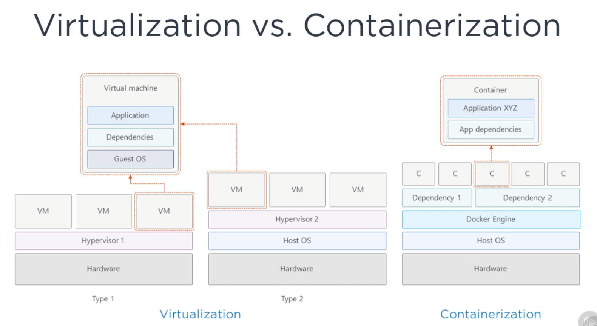
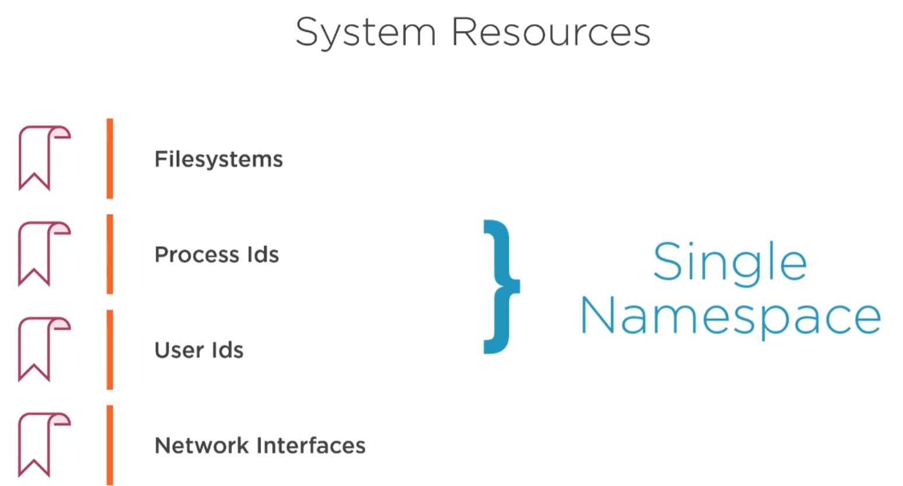

Containers
Kubernetes
MiniKube

### Microservices

* Monoliths are broken down into smaller, independently running components called Microservices

* Microservices are decoupled from each other, and therefore they can be developed, deployed, updated and scaled individually
* Each microservice exposes its functionality or services via an interface, typically a REST API

### Microservices - the Bad Parts

* Many components, many moving parts

* Difficult to manage inter-communication

* Difficult to achieve high resource utilization

* Manual management can be difficult

### Solution - We need Orchestrator

We need automation, which includes automatic scheduling automatic configuration, supervision, and failure-handling

### Kubernetes ...

Kubernetes is an open-source system for automating deployment, scaling, and management of containerized applications.

* Enables developers to deploy their applications themselves and as often as they want

* Enables the ops team by automatically monitoring and rescheduling those apps in the event of a hardware failure

* The focus from supervising individual apps to mostly supervising and managing Kubernetes and the rest of the infrastructure

* Abstracts away the hardware infrastructure and exposes your whole datacenter as a single gigantic computational resource

### Containers 

Containers offer the light weight design of a Process and the isolation of an Operating System

VM's have to be Patched, Upgraded, Maintained

Containers use Namespaces

Namespaces offer Isolation

The process will only see resources that are inside the same namespace

Process doesn't belong to one namespace, but to one namespace of each kind

### Namespace Kinds

* Mount (mnt)
* Process ID (pid)
* Network (net)
* Inter-process communication (ipc)
* UTS
* User ID (user)

The UTS namespace determines what hostname and domain name the process running inside that namespace sees

Process 1 - UTS1 -- > Localhost 1

Process 2 -- UTS 2 -- > Localhost 2

What network namespace a process belongs to determines which network interfaces the application running inside the process sees

Each container uses its own Network namespace, and therefore each container sees its own set of network interfaces

Namespaces offer Isolation

---

How do you limit the amount of system resources a container can consume?

### Control Groups (Cgroups)

* Linux kernel feature that limits the resource usage of a process (or a group of processes)
* A process can't use more than the configured amount of CPU, memory, network bandwidth, and so on
* Cgroups prevent processes from hogging resources reserved for other processes

https://en.wikipedia.org/wiki/LXC

---

### Docker

* Simplifies packaging applications and its dependencies
* Consistent experience
* Host isolation

### Benefits of Docker

* Docker offers images as well 
* Docker uses Namespaces and Control Groups to offer isolation and resource controls
* Container images are much smaller in size as compared to VM images

### Docker is a platform for packaging, distributing, and running applications

* **Images :** The image contains the filesystem and path to the application executable when you run the image.
*  **Registries :** A Docker Registry is a repository that stores your Docker images and allows easy sharing of those images between different people and computers
*  **Containers :** A running container is a process running on the host running Docker, but it's completely isolated from both the host and all other processes running on it

### The Docker Workflow

`Step 1` Developer first builds and image and pushes it to the Docker Registry.
`Step 2` Pull the image from the Docker Registry.
`Step 3` Run the image on a Docker host
---

### Kubernetes

* A software system that allows you to easily deploy and manage containerized applications on top of it.
* Exposes the underlying infrastructure as a single computational resource.
* Consistent deployment experience regardless of the size of the cluster.

**Kubernetes Cluster Node Types**

1. Master Node(s) - It hosts Kubernetes control plane that controls and manages the whole Kubernetes system.
   * Control plane - is what controls the cluster and makes it function.
   * It consists of multiple components that can run on a single master node or be split across multiple nodes and replicated to ensure high availability.
   * Master Node Components- 
        - The Kubernetes API server - 
        - The Scheduler - schedules your applications
        - Controller manager - which performs the cluster-level functions, such as replicating component. Keepinf track of worker nodes.
        - etcd - Reliable distributed data store that persistently stores the cluster configuration.

2. Worker Node(s) - It runs actual applications 
   *  Components - 
       - Container runtime - which can be Docker or rkt.
       - Kubelet - Which talks with the API server and manages containers on its node.
       - Kubernetes service proxy - which load balances network traffic between the application components.
---

### Running an Application in Kubernetes
1. Package your application in to one or more containers
2. Push those images to an Image Registry
3. Post App Descriptor to the Kubernetes API Server
4. Scheduler schedules containers on available Worker Nodes
5. Kubelet instructs Nodes to download Container Images
6. Kubelet instructs Nodes to run the Containers

