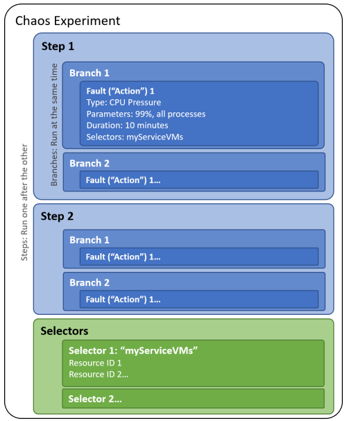

### Chaos engineering is the discipline of intentionally injecting failures into your systems to see how they respond.

It is to move from a reactive to a proactive approach to build resilient systems.
  - Uncovering Hidden Weaknesses
  - Improve System Resilience
  - Reduce Downtime and Costs
  - Validate Monitoring and Alerting
---
This concept was first started by Netflix in the late 2000s. They created "Chaos Monkey," a tool that randomly terminated production instances.

 * A chaos experiment is an Azure resource deployed to a subscription, resource group, and region. 
 * You can use the Azure portal or the Chaos Studio REST API to create, update, start, cancel, and view the status of an experiment. 
 * Chaos experiments can target resources in a different subscription than the experiment if the subscription is within the same Azure tenant. 
 * Chaos experiments can target resources in a different region than the experiment if the region is a supported region for Chaos Studio.
---
### Chaos Studio scenarios
   1. **Shift right:** production or preproduction environment. Usually, with real customer traffic or simulated load.
   2. **Shift left:** development or shared test environment. without any real customer traffic.

---
### Chaos Studio supports two types of faults:

   1. **Service-direct:** These faults run directly against an Azure resource, without any installation or instrumentation. 
       - Examples include rebooting an Azure Cache for Redis cluster or adding network latency to Azure Kubernetes Service pods.
   2. **Agent-based:** These faults run in VMs or virtual machine scale sets to do in-guest failures. 
       - Examples include applying virtual memory pressure or killing a process.

---
### Chaos experiment is divided into two sections:

   1. **Selectors:** Groups of target resources that have faults or other actions run against them.. 
       - For example, you might have a selector named AllNonProdEastUSVMs, in which you've added all the nonproduction virtual machines in East US. You could then apply CPU pressure followed by virtual memory pressure to those virtual machines by referencing the selector..
   2. **Logic:** The rest of the experiment describes how and when to run faults. 
        - An experiment is organized into steps that run one after the other. 
        - Each step has one or more branches that run at the same time. 
        - Steps and branches allow you to inject multiple faults across resources in your environment in parallel.
        - Each branch has one or more actions, which are either the faults you want to run or time delays. 
          
           
---
### Faults and Actions

   1. **Action:** Every activity that happens as part of an experiment is called an action.
       - The most common type of action is a fault.
       - Actions are organized into steps and branches, enabling actions to run either sequentially or in parallel. 
       - Every action has the following properties:
          1. **Name:** The specific action that takes place. A name usually takes the form of a URN for the action, for example, urn.
          2. **Type:** The way that the action executes. 
                - either continuous or discrete.
        ### Types of actions          
         1. **Faults:** This action causes a disruption in one or more resources.
         2. **Time delays:** This action "waits" without affecting any resources. It's useful for pausing in between faults to wait for a system to be affected by the previous fault.

   2. **Faults:** Faults are the most common action in Chaos Studio. Faults cause a disruption in a system. 
       - Faults can be:
            * Be destructive. For example, a fault can kill a process.
            * Apply pressure. For example, a fault can add virtual memory pressure.
            * Add latency.
            * Cause a configuration change.
---
### Targets and capabilities:

   * Before you can inject a fault against an Azure resource.
   * The resource must first have corresponding targets and capabilities enabled. 
   * Targets and capabilities control which resources are enabled for fault injection and which faults can run against those resources.
        - For example, with targets and capabilities, you can allow the CPU pressure fault to run against your `production virtual machines` while preventing the kill process fault from running against them.

   1. **Targets:** a Target is the specific part of your system (like a virtual machine, database, or network) that you want to intentionally "break" or test with chaos experiments. 
      * how it's allowed to mess with it, is the `"target type"`.
       
       - Resource types that only support `service-direct` faults have one target type.
         * An example is the `Microsoft-CosmosDB` type for Azure Cosmos DB.
       - Resource types that support `service-direct` and `agent-based` faults have two target types.
         * One target type is for `service-direct` faults (for example, `Microsoft-VirtualMachine`).
         * The other target type is for `agent-based` faults (always `Microsoft-Agent`).
         * A target defines the target type that's enabled on the resource.
            - For example, if you're onboarding an Azure Cosmos DB instance with this resource ID:
                * `/subscriptions/aaaa0a0a-bb1b-cc2c-dd3d-eeeeee4e4e4e/resourceGroups/chaosstudiodemo/providers/Microsoft.DocumentDB/databaseAccounts/myDB`
            - The Azure Cosmos DB resource has a child resource formatted like this example:
                * `/subscriptions/aaaa0a0a-bb1b-cc2c-dd3d-eeeeee4e4e4e/resourceGroups/chaosstudiodemo/providers/Microsoft.DocumentDB/databaseAccounts/myDB/providers/Microsoft.Chaos/targets/Microsoft-CosmosDB`
   2. **Capabilities:** A capability enables Chaos Studio to run a particular fault against a resource, such as shutting down a virtual machine. 
       - Capabilities are unique per target type.
       - They represent the fault that they enable.
       - for example, `CPUPressure-1.0`.
     
       
       * A capability is an extension resource created as a child of a target. For example, if you're enabling the shutdown fault on a virtual machine with a service-direct target ID:
          + `/subscriptions/aaaa0a0a-bb1b-cc2c-dd3d-eeeeee4e4e4e/resourceGroups/myRG/providers/Microsoft.Compute/virtualMachines/myVM/providers/Microsoft.Chaos/targets/Microsoft-VirtualMachine`
       * The target resource has a child resource formatted like this example:
          + `/subscriptions/aaaa0a0a-bb1b-cc2c-dd3d-eeeeee4e4e4e/resourceGroups/myRG/providers/Microsoft.Compute/virtualMachines/myVM/providers/Microsoft.Chaos/targets/Microsoft-VirtualMachine/capabilities/shutdown-1.0`
       
---
### Target selection in Azure Chaos Studio

1. **List-based manual target selection:** allows you to select a fixed set of onboarded targets for a particular fault in your chaos experiment.
2. **Query-based dynamic target selection:** allows you to input a KQL query that selects all onboarded targets that match the query result set.
      -  Using your query, you can filter targets based on common Azure resource parameters including type, region, name, and more.
      -  Upon experiment creation time, only the query itself is added to your chaos experiment.
4. **Target scoping:** "Target scoping" means you can choose to make a chaos experiment affect only a very specific part or function within a larger Azure resource, instead of the whole thing. 
      - For example, instead of shutting down an entire group of virtual machines, you might use target scoping to only shut down a specific instance within that group. If you don't choose a specific scope, the fault will apply to the entire resource you've targeted.
---
### Quickstart: Create and run a chaos experiment by using Azure Chaos Studio
   1. Prerequisites: You need an Azure subscription and a Linux virtual machine.
   2. Register Resource Provider: Register the Microsoft Chaos resource provider in your subscription.
   3. Enable Chaos Studio on VM: In the Chaos Studio portal, select your VM as a "target" to enable Chaos Studio on it.
   4. Create Experiment: Create a new chaos experiment, defining the "fault" you want to introduce (e.g., VM shutdown) and its duration.
   5. Grant Permissions: Grant the `experiment's managed identity` the "Virtual Machine Contributor" role on the VM's Access control (IAM) page.
   6. Run and Monitor: Start the experiment from the Chaos Studio interface and monitor its execution.

---
# Chaos Experiment Details

| **Field**        | **Description**                                                                     |
| :----------- | :------------------------------------------------------------------------------ |
| **Hypothesis** | Define the objective and expected outcomes of the experiment.                   |
| **Target Scope** | Identify which part of the system will be subjected to chaos experiments (e.g., network, database, application layer). |
| **Target** | Determine the specific targets or components within the system.                 |
| **Environment** | Define whether the experiment will be conducted in a production, staging, or development environment. |
| **Duration** | Specify the time frame for the chaos experiment.                                |
| **Observations** | Record any data or behavior observed during the experiment.                     |
| **Results** | Summarize the findings and outcomes of the experiment.                          |
| **Action Items** | List any action items or steps to be taken based on the results.                |

---

This table provides a clear and organized way to outline the essential details for any chaos experiment. Do you have a specific experiment in mind that you'd like to plan out using this table?

* Polly is a .NET resilience and transient-fault-handling library.
* With Polly, you can gracefully handle these issues and make your application robust and self-healing.
* Chaos Studio is the "attack," and Polly is the "defense" that you build into your C# code.
* Polly allows you to wrap your C# code (e.g., an HttpClient call) inside one or more "policies."

1. Retry : This is the simplest and most common policy. If an operation fails, try it again.
   - What it does: Catches a specific exception (like a network error) and re-runs your code.
   - Best Practice: Use it with a "wait and retry" strategy, often with exponential backoff (e.g., wait 1s, then 2s, then 4s). This prevents you from hammering a service that is already struggling.
   - Chaos Studio Context: Chaos Studio adds 500ms of network latency. Your code times out and fails. The Polly Retry policy catches the timeout, waits, and tries again, and this time it succeeds.

2. Circuit Breaker : This is a critical pattern for preventing cascading failures.

   - What it does: If a specific operation fails too many times in a row, the "circuit opens." For a configured period (e.g., 30 seconds), Polly won't even try to execute your code. It will fail immediately, protecting your application from wasting resources on a service that is clearly down. After the timeout, it will let one test call through (the "half-open" state) to see if the service has recovered.
   - Chaos Studio Context: Chaos Studio shuts down a dependency VM. Your first few calls fail, and Polly's Circuit Breaker trips. For the next 30 seconds, your app fails fast without waiting for timeouts, perhaps returning a cached response. This improves your app's performance and stability even when its dependency is offline.

3. Timeout : Ensures that one slow operation doesn't stall your entire application.
   - What it does: Enforces a time limit on an operation. If it doesn't complete within the specified time, Polly will cancel it.
   - Chaos Studio Context: Chaos Studio injects a CPU spike on a dependency, making it slow to respond. Polly's Timeout policy ensures your calling application gives up after a reasonable time instead of hanging indefinitely.
4. Fallback : Provides a graceful alternative when an operation fails.
    - What it does: If your code fails (and all retries are exhausted), instead of throwing an exception, it executes an alternative piece of code.
    - Chaos Studio Context: Your code tries to call a service to get a user's name, but the service is down (thanks to Chaos Studio). The Polly Fallback policy catches the final error and returns a default value like "Guest" instead of crashing the user's session.

Putting It All Together: The C# Developer's Role
 Here is the workflow:
   1. Run Experiment: Azure Chaos Studio injects a fault into your infrastructure.
   2. Observe Failure: Your application, which lacks resilience logic, crashes or behaves poorly.
   3. Implement Policy: You, the C# developer, open the code. You identify the fragile call (e.g., httpClient.GetAsync(...)).
   4. Wrap with Polly: You wrap that call in a Polly policy. You might even combine them: "Retry 3 times, with a 2-second timeout on each attempt. If all retries fail, open the circuit breaker for 30 seconds and execute the fallback logic."
